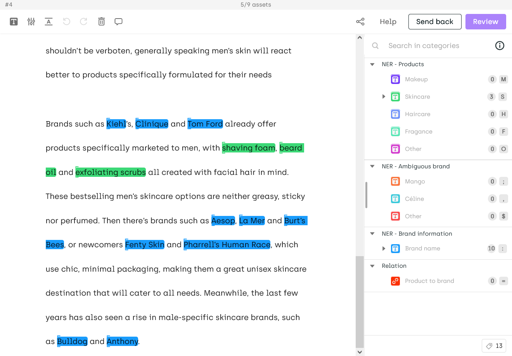
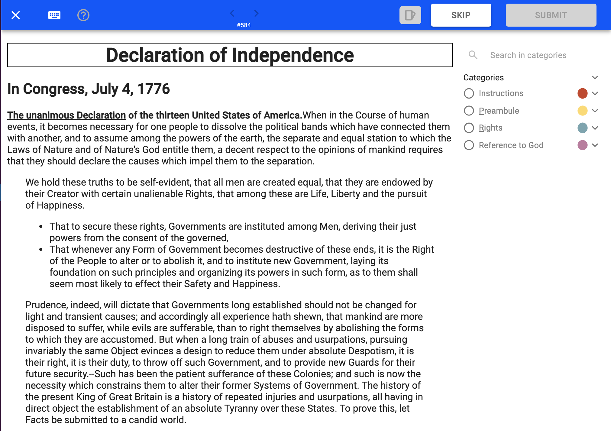
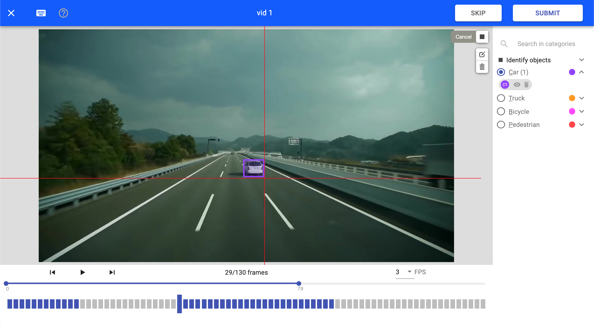
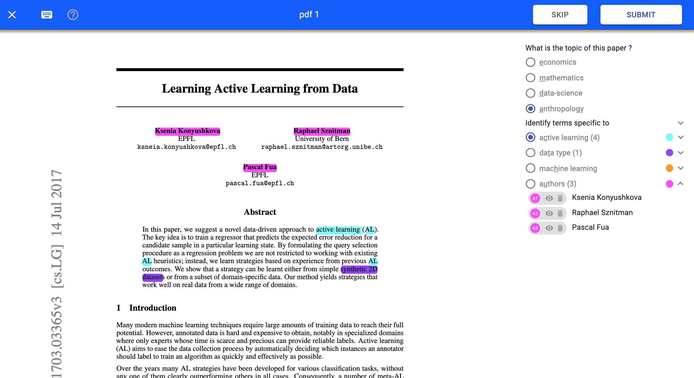
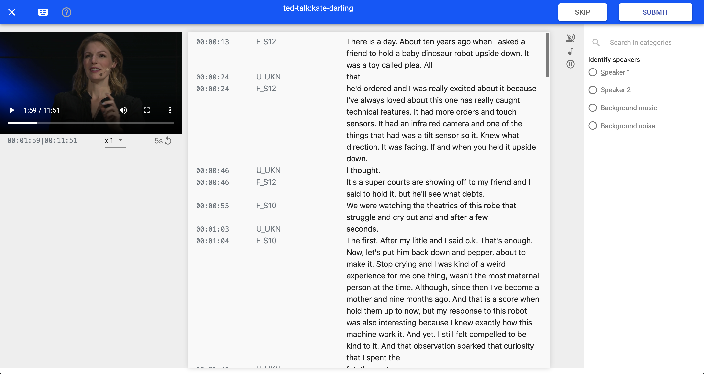
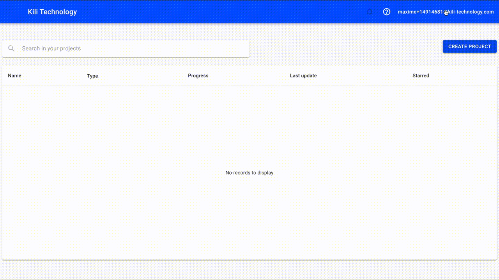

# Image and Text Annotation Tool - Kili Playground

[](https://www.python.org/downloads/release/python-370/)
[](https://travis-ci.org/kili-technology/kili-playground)

## What is Kili Technology?

Kili Technology is an image, text and voice data annotation tool designed to help companies deploy machine learning applications faster. In a few minutes you can start annotating your data thanks to a catalogue of intuitive and configurable interfaces. You can easily accelerate the labeling process by connecting one of your models to pre annotate the data. The work of the annotators is 2 to 5 times faster. Kili Technology facilitates collaboration between technical teams and the business, but also with outsourced annotation companies. Data governance is managed, and production quality control is facilitated. Kili Technology meets the needs of small teams as well as those of large companies with massive stakes.

Kili Technology allows you to:

- Quickly annotate **text**, **images**, **video**, **audio** and **frames** (3D images, DICOM Images and scans) thanks to simple and intuitive interfaces
- Easily ingest data, in drag & drop, from your cloud provider, or while keeping your data On Premise, when necessary.
- Manage participants, roles and responsibilities
- Monitor production quality using leading indicators and workflows for production monitoring and data quality validation
- Easily export the produced data

### Text annotation example

|   Named Entities Extraction and Relation    |        Rich format support         |
| :-----------------------------------------: | :--------------------------------: |
|  |  |

### Image annotation example

|                Classification                | Object detection (bounding-box here) |
| :------------------------------------------: | :----------------------------------: |
|  |   |

### Video annotation example

|                Video annotation                |        Video classification         |
| :--------------------------------------------: | :---------------------------------: |
|  |  |

### Other interfaces

|              Pdf               |                 Speech to Text                  |
| :----------------------------: | :---------------------------------------------: |
|  |  |

## What is Kili Playground ?

Kili Playground is a Python client wrapping the GraphQL API of Kili Technology.
It allows data scientists and developers to control Kili Technology from an IDE.

## Installation

- Clone the repository and install with pip

```bash
pip install kili
```

## Get started

- Export an API KEY In `My Account` -> `API KEY` :



- In your favourite IDE :

```python
from kili.client import Kili
kili = Kili(api_key='MY API KEY')
# You can now play with the playground
```

You can follow those tutorials to get started :

- [Getting started on Kili Classification task](https://github.com/kili-technology/kili-playground/blob/master/recipes/getting-started/getting_started-classification.ipynb)
<!-- - Getting started on Kili Object Detection task
- Getting started on Kili Named Entities Recognition task
- Getting started on Kili Speech to Text task -->

You can find all of recipes [here](/recipes/). Among them:

- [How to import assets](https://github.com/kili-technology/kili-playground/blob/master/recipes/import_assets.ipynb) (run it [here](https://colab.research.google.com/github/kili-technology/kili-playground/blob/master/recipes/import_assets.ipynb))
- [How to export labels](https://github.com/kili-technology/kili-playground/blob/master/recipes/export_labels.ipynb) (run it [here](https://colab.research.google.com/github/kili-technology/kili-playground/blob/master/recipes/export_labels.ipynb))
- [How to import predictions](https://github.com/kili-technology/kili-playground/blob/master/recipes/import_predictions.ipynb) (run it [here](https://colab.research.google.com/github/kili-technology/kili-playground/blob/master/recipes/import_predictions.ipynb))
- [How to query data through the API](https://github.com/kili-technology/kili-playground/blob/master/recipes/query_methods.ipynb) (run it [here](https://colab.research.google.com/github/kili-technology/kili-playground/blob/master/recipes/query_methods.ipynb))
- [How to use AutoML for faster labeling with Kili](https://github.com/kili-technology/kili-playground/blob/master/recipes/automl_text_classification.ipynb) (run it [here](https://colab.research.google.com/github/kili-technology/kili-playground/blob/master/recipes/automl_text_classification.ipynb))
- [How to use Transfer Learning for faster labeling with Kili](https://github.com/kili-technology/kili-playground/blob/master/recipes/transfer_learning_with_yolo.ipynb) (run it [here](https://colab.research.google.com/github/kili-technology/kili-playground/blob/master/recipes/transfer_learning_with_yolo.ipynb))

If you want more details on what you can do with the API, follow the [technical documentation](https://cloud.kili-technology.com/docs/python-graphql-api/python-api).
