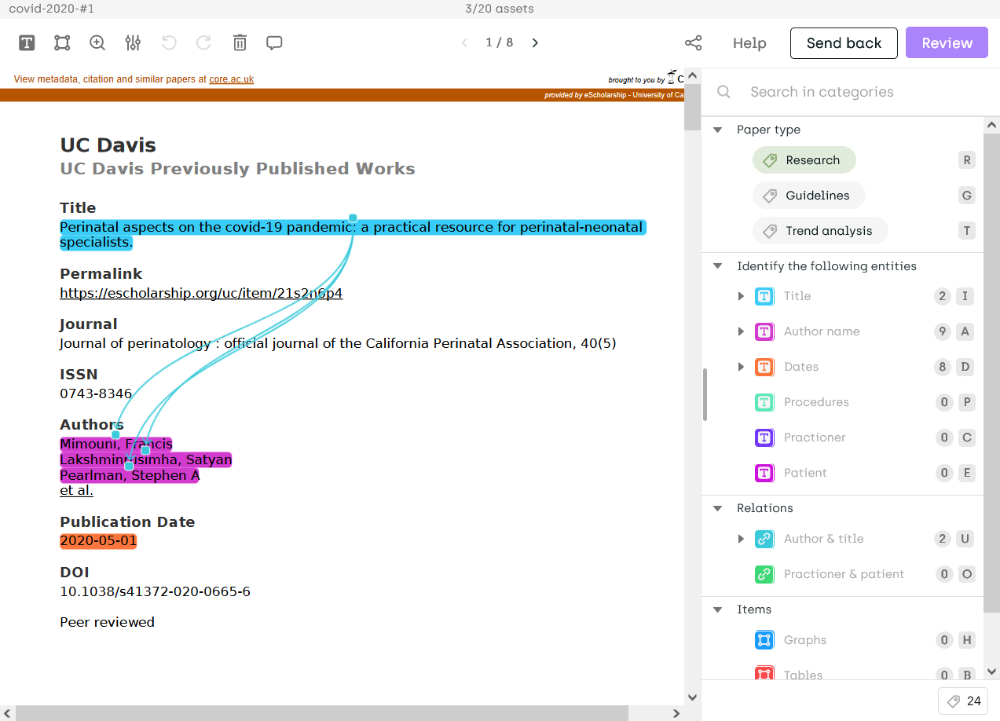
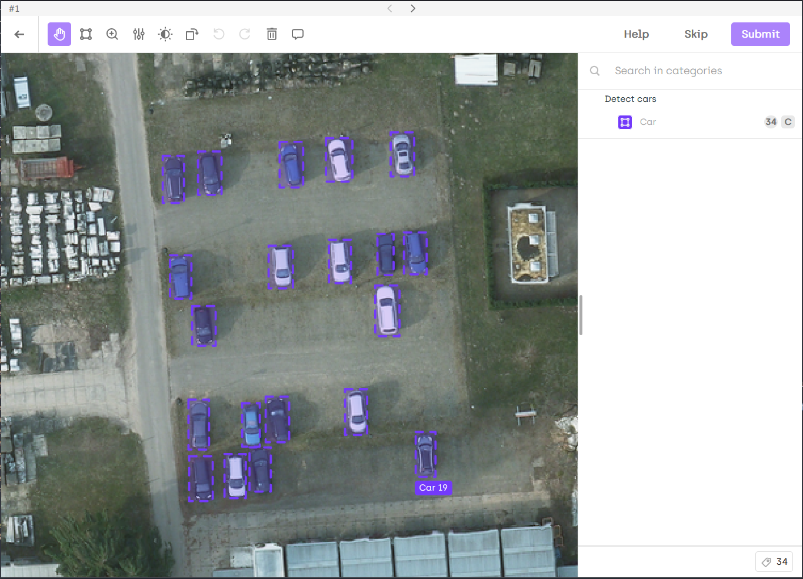

# Kili Playground: Kili's Python SDK

[](https://www.python.org/downloads/release/python-370/)
[](https://travis-ci.org/kili-technology/kili-playground)

[Technical Documentation](https://cloud.kili-technology.com/docs/python-graphql-api/python-api)

## What is Kili?

Kili is a platform that empowers a data-centric approach to Machine Learning through quality training data creation. It provides collaborative data **annotation tools** and APIs that enable quick iterations between reliable dataset building and model training. More info [here](https://kili-technology.com/product/label-annotate).
### Annotation tools examples

|   Named Entities Extraction and Relation    | PDF classification and bounding-box |   Object detection (bounding-box)   |
| :-----------------------------------------: | :---------------------------------: | :---------------------------------: |
|  |   |  |

and [many more](https://cloud.kili-technology.com/docs/labeling/labeling-overview/#available-labeling-job-types-per-asset-type-a-idjob-types-per-asset-typea).

## What is Kili Playground?

Kili Playground is the home of the **Kili Python SDK**. It comes with several [recipes](recipes/) that demonstrate its most frequent use cases.


## Requirements
* Python >= 3.7
* Create and copy a [Kili API key](recipes/api_key.md)
* Add the `KILI_API_KEY` variable in your bash environment (or in the settings of your favorite IDE) by pasting the API key value you copied above:
```bash
export KILI_API_KEY='<you api key value here>'
```

## Installation

Install the Kili client with pip:

```bash
pip install kili
```

## Usage

Instantiate the Kili client:
```python
from kili.client import Kili
kili = Kili()
# You can now use the Kili client!
```
Note that you can also pass the API key as an argument of the `Kili` initialization:
```python
kili = Kili(api_key='MY API KEY')
```
Here is a sample of the operations you can do with the Kili client:
### Creating an annotation project
```python
json_interface = {
    "jobs": {
        "CLASSIFICATION_JOB": {
            "mlTask": "CLASSIFICATION",
            "content": {
                "categories": {
                    "RED": {"name": "Red"},
                    "BLACK": {"name": "Black"},
                    "WHITE": {"name": "White"},
                    "GREY": {"name": "Grey"}},
                "input": "radio"
            },
            "instruction": "Color"
        }
    }
}
project = kili.create_project(
        title="Color classification",
        description="Project ",
        input_type="IMAGE",
        json_interface=json_interface
)["id"]
```
### Importing data to annotate
```python
assets = [
    {
        "externalId": "example 1",
        "content": "https://images.caradisiac.com/logos/3/8/6/7/253867/S0-tesla-enregistre-d-importantes-pertes-au-premier-trimestre-175948.jpg",
    },
    {
        "externalId": "example 2",
        "content": "https://img.sportauto.fr/news/2018/11/28/1533574/1920%7C1280%7Cc096243e5460db3e5e70c773.jpg",
    },
    {
        "externalId": "example 3",
        "content": "./recipes/img/man_on_a_bike.jpeg",
    },
]

external_id_array = [a.get("externalId") for a in assets]
content_array = [a.get("content") for a in assets]

kili.append_many_to_dataset(
        project_id=project_id,
        content_array=content_array,
        external_id_array=external_id_array,
)
```
See the detailled example in this [notebook](recipes/import_assets.ipynb).

### Importing predictions
```python
prediction_examples = [
    {
        "external_id": "example 1",
        "json_response": {
            "CLASSIFICATION_JOB": {
                "categories": [{"name": "GREY", "confidence": 46}]
            }
    },
    {
        "external_id": "example 2",
        "json_response": {
            "CLASSIFICATION_JOB": {
                "categories": [{"name": "WHITE", "confidence": 89}]
            }
        },
    }
]

kili.create_predictions(
        project_id=project_id,
        external_id_array=[p["external_id"] for p in prediction_examples],
        model_name_array=["My SOTA model"] * len(prediction_examples),
        json_response_array=[p["json_response"] for p in prediction_examples])

```
See detailled examples in this [notebook](recipes/import_predictions.ipynb).

### Exporting labels
```python
assets = kili.assets(project_id=project_id)

with open("labels.json", "w") as label_file:
    for asset in assets:
        for label in asset.labels:
            label_file.write(label.json_response(format='simple'))
```
See a detailled example in this [notebook](recipes/export_labels.ipynb).

## More examples

You can find all several recipes in this [folder](/recipes/). Among them:

- [How to import assets](recipes/import_assets.ipynb) (run it [here](https://colab.research.google.com/github/kili-technology/kili-playground/blob/master/recipes/import_assets.ipynb))
- [How to export labels](recipes/export_labels.ipynb) (run it [here](https://colab.research.google.com/github/kili-technology/kili-playground/blob/master/recipes/export_labels.ipynb))
- [How to import predictions](recipes/import_predictions.ipynb) (run it [here](https://colab.research.google.com/github/kili-technology/kili-playground/blob/master/recipes/import_predictions.ipynb))
- [How to query data through the API](recipes/query_methods.ipynb) (run it [here](https://colab.research.google.com/github/kili-technology/kili-playground/blob/master/recipes/query_methods.ipynb))
- [How to use AutoML for faster labeling with Kili](recipes/automl_text_classification.ipynb) (run it [here](https://colab.research.google.com/github/kili-technology/kili-playground/blob/master/recipes/automl_text_classification.ipynb))

For more details, read the [technical documentation](https://cloud.kili-technology.com/docs/python-graphql-api/python-api).
