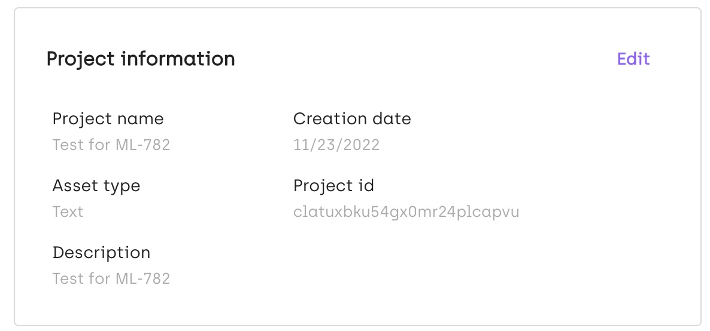

# How to export a Kili project
## Outline
This tutorial explains the multiple ways to export a Kili project. It describes a per-label method involving label filtering and conversion, and also the solutions performing a full-project export. The methods are illustrated with code snippets.

## Export methods
With Kili, once you have annotated enough assets, you can export the data programmatically to train a machine learning algorithm with it. There are several ways to do it:

 * Fetch the assets and/or the labels one by one using [`.assets`](https://python-sdk-docs.kili-technology.com/latest/sdk/asset/#kili.queries.asset.__init__.QueriesAsset.assets) or [`.labels`](https://python-sdk-docs.kili-technology.com/latest/sdk/label/#kili.queries.label.__init__.QueriesLabel.labels), perform the data transformation yourself, then write the data to one or several output files.
 * Export the whole project as a dataset. To do that, use the [`.export_labels`](https://python-sdk-docs.kili-technology.com/latest/sdk/label/#kili.queries.label.__init__.QueriesLabel.export_labels) method that creates an archive containing the labels in your chosen format.


## Preliminary steps
 1. Fetch the project ID from the Kili UI (in Settings / Admin):
   
 2. Ensure that your Kili API key as been set as an environment variable:
 ```bash
 export KILI_API_KEY=<YOUR_API_KEY>
 ```
 3. Install Kili if it has not been done already.
```bash
pip install --upgrade kili
```

 4. Import packages and instantiate `Kili`:
```python
from kili.client import Kili
from pathlib import Path
kili = Kili()
```
## Exporting assets and labels one by one
To retrieve all assets of a project one by one, perform the following steps:

### Exporting the latest labels per asset
 1. First, fetch the assets:
```python
assets = kili.assets("<your_project_id>", fields=["externalId", "latestLabel.jsonResponse"])
```
 2. Now if you print an asset, you will see that you can access its `latestLabel`:
```python
print(assets[0])
{'latestLabel': {'jsonResponse': {'CLASSIFICATION_JOB': {'categories': [{'name': 'VEHICLE'}]}}}, 'externalId': '0'}
```
  3. You can now get your label this way, and for example write the category name into a `0.txt` file:
```python
for asset in assets:
    if asset["latestLabel"]: # covers the assets without label
        class_ = asset["latestLabel"]["jsonResponse"]["CLASSIFICATION_JOB"]["categories"][0]["name"]
        with (Path("/tmp") / (asset["externalId"] + ".txt")).open("w", encoding="utf-8") as f:
            f.write(class_)
```


### Filtering specific labels per asset through the method filters
You can specify label filters directly in the `.assets`(https://python-sdk-docs.kili-technology.com/latest/sdk/asset/#kili.queries.asset.__init__.QueriesAsset.assets) and the `.labels`(https://python-sdk-docs.kili-technology.com/latest/sdk/label/#kili.queries.label.__init__.QueriesLabel.labels) methods. The available filters are listed in the arguments
of these methods.

When done, you can write the conversion code to obtain the data in the format that you need.

**Get only the assets that have labels with a consensus mark above 0.7**
```python
assets = kili.assets("<your_project_id>", fields=["externalId", "labels.jsonResponse"], label_consensus_mark_gt=0.7)
# + asset conversion code
```

**Get all the labels with a consensus mark above 0.7**
```python
labels = kili.labels("<your_project_id>", fields=["labelOf.externalId", "jsonResponse"], consensus_mark_gt=0.7)
# + label conversion code
```

**Get all the labels done by a specific project member**
```python
labels = kili.labels("<your_project_id>", fields=["labelOf.externalId", "jsonResponse"], author_in=["John Smith"])
# + label conversion code
```
will directly return a list of labels authored by John Smith. In the `author_in` , you can also pass the first name, the last name, or the first name + last name of the user for which you want to fetch the labels.


### Filtering specific labels per asset through the label properties
You can also look for specific labels, for example the last "review" status label per user, and dump the result into a json file. You can use the field `"labels.isLatestReviewLabelForUser"` to check if the label is the latest per user.
```python
assets = kili.assets("<your_project_id>", fields=["externalId", "labels.jsonResponse", "labels.isLatestReviewLabelForUser"])

for asset in assets:
    if asset["labels"]: # covers the assets without annotations
        for label in asset["labels"]:
            if label["isLatestReviewLabelForUser"] and "JOB_0" in label["jsonResponse"]:
                annotation = label["jsonResponse"]["JOB_0"]
                with (Path("/tmp") / (asset["externalId"] + ".json")).open("w", encoding="utf-8") as f:
                    f.write(json.dumps(annotation))
                break # once we find a latest label done by a reviewer, we move on to the next asset.
```

## Exporting a whole project
There is also a method to export the whole project into specific export formats. It can be useful when your goal is to use one of the standard output formats.

### Available formats


| Format        | UI  | Python Client | Command Line Interface |
| ------------- | --- | ------------- | ---------------------- |
| Kili (raw)    | ✅   | ✅             | ✅                      |
| Kili (simple) | ✅   | ❌             | ❌                      |
| YOLO V4       | ✅   | ✅             | ✅                      |
| YOLO V5       | ✅   | ✅             | ✅                      |
| YOLO V7       | ❌   | ✅             | ✅                      |
| Pascal VOC    | ✅   | ✅             | ✅                      |
| COCO          | ❌   | ✅             | ✅                      |


### The `.export_labels` method

The `.export_labels` method enables the export of a full project. It does the following preprocessing:

* Only fetches the labels of types `"DEFAULT"` and `"REVIEW"` (see the [label types explanations](https://docs.kili-technology.com/docs/asset-lifecycle#label-types-and-definitions-throughout-an-asset-lifecycle)).
* If specified, selects a subset of asset ids.
* Exports labels to one of the standard formats (only available for a restricted set of ML tasks).
* The `with_assets` argument lets you decide if you want to include the assets in the export.
* The `export_type` argument tells if the latest label or all the labels are exported.
* The `split_option` argument tells if the export contains one folder for all the jobs, or one folder per job.
* The `single_file` argument tells if the labels data should be exported into one single file. Note that some formats are single_file only, and that some others cannot be output into a single file.
     * Kili: single file or multiple files.
     * YOLO: multiple files only.
     * Pascal VOC: multiple files only.
     * COCO: single-file only.

For all the formats, in the output archive, a README.kili.txt file is also created. Here is an example of its contents:
```
Exported Labels from KILI
=========================

- Project name: Awesome annotation project
- Project identifier: abcdefghijklmnop
- Project description: This project contains labels, most of which are awesome.
- Export date: 20221125-093324
- Exported format: kili
- Exported labels: latest
```


### Kili format, one file per asset
The following code snippet exports all the assets payloads and the associated labels, with one json file per asset, into the `/tmp/export.zip` folder.
```python
from kili.client import Kili
kili = Kili()
kili.export_labels(
    project_id = "<your_project_id>",
    filename = "/tmp/export.zip",
    fmt = "kili",
)
```


### Kili format, one file for the whole project
This code snippet exports the assets payloads and the associated labels in one file for the whole project, into the `/tmp/export.zip` folder.
```python
from kili.client import Kili
kili = Kili()
kili.export_labels(
    project_id = "<your_project_id>",
    filename = "/tmp/export.zip",
    fmt = "kili",
    single_file = True,
)
```

### YOLO formats
You can also export to on of the YOLO format, when you have at least one Object Detection job with bounding boxes. You can choose the `"yolo_v4"`, `"yolo_v5"` or `"yolo_v7"`. The difference between each format is the structure of the metadata YAML file, which specifies the object classes. In all the cases, it produces one file per asset in the Yolo format, containing the last `DEFAULT` or `REVIEW` label that has been produced. Each YOLO label has the following shape:
```
2        0.25 0.67 0.26 0.34
^        ^    ^    ^    ^
class    x    y    w    h
```
where:

   * `class` is the class index in the classes list contained in the YOLO metadata file.
   * `x` is the x-coordinate relative to the image width (between 0.0 and 1.0) of the center of the bounding box.
   * `y` is the y-coordinate relative to the image height (between 0.0 and 1.0) of the center of the bounding box.
   * `w` is the width relative to the image width (between 0.0 and 1.0) of the bounding box.
   * `h` is the height relative to the image height (between 0.0 and 1.0) of the bounding box.

Here is an example of a YOLO annotation over an image:
<br>


Here is how to export to YOLO (in this example, YOLOv5):
```python
from kili.client import Kili
kili = Kili()
kili.export_labels(
    project_id = "<your_project_id>",
    filename = "/tmp/export.zip",
    fmt = "yolo_v5",
)
```

Please note that a standard YOLO file format must also include the path root to the assets, and also the `train`, `val` and `test` subfolders. Since this is up to the ML engineer or Data scientist to know which data goes where, we do not provide this layout.


### COCO format
To export your data into the COCO format, run the following code:
```python
from kili.client import Kili
kili = Kili()
kili.export_labels(
    project_id = "<your_project_id>",
    filename = "/tmp/export.zip",
    fmt = "coco",
)
```

This will create an archive containing both:

 * The COCO annotation file.
 * A folder `data/` with all the assets.

## Summary
In this tutorial, we have seen several ways to export labels from a Kili project:

* Using [`.assets`](https://python-sdk-docs.kili-technology.com/latest/sdk/asset/#kili.queries.asset.__init__.QueriesAsset.assets) and [`.labels`](https://python-sdk-docs.kili-technology.com/latest/sdk/label/#kili.queries.label.__init__.QueriesLabel.labels) and their filtering arguments, a subset of assets or labels can be selected and then exported.
* Using [`.export_labels`](https://python-sdk-docs.kili-technology.com/latest/sdk/label/#kili.queries.label.__init__.QueriesLabel.export_labels), the whole project can be exported into a standard output format.
