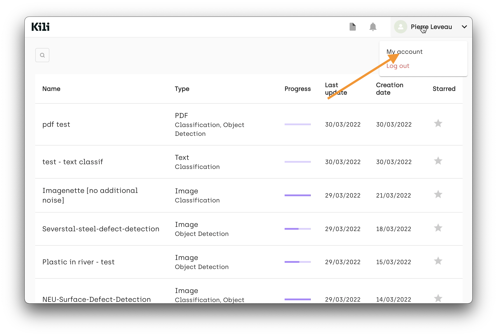
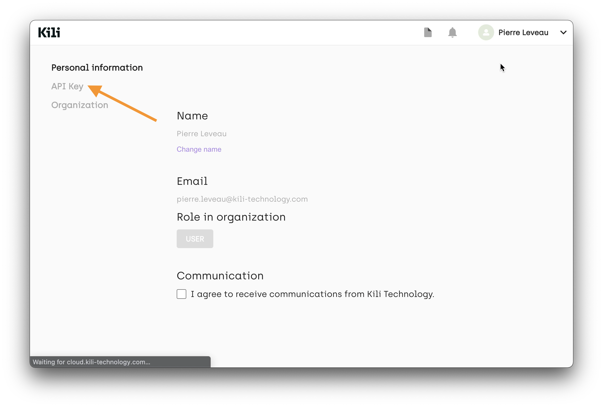
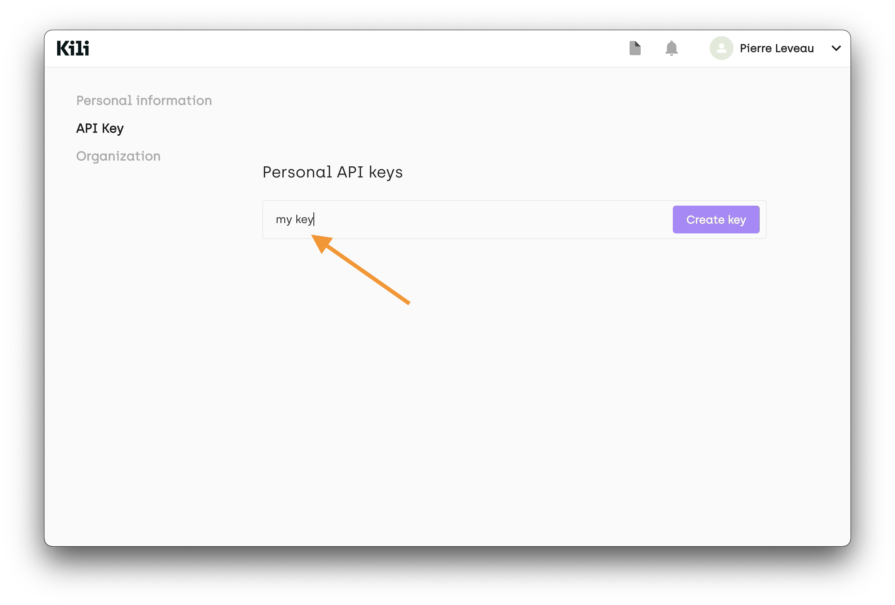
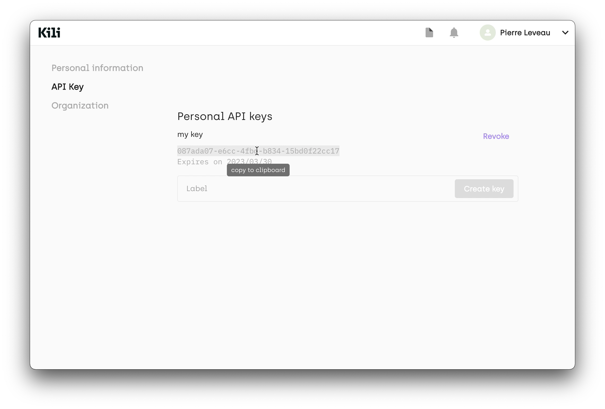

# API Key creation

The following steps detail how to create an API key from your account page.

* Go to your **My account** page

* Go to the **API key** section

* Enter a name of your choice for your API key

* Copy the API Key to the clipboard

